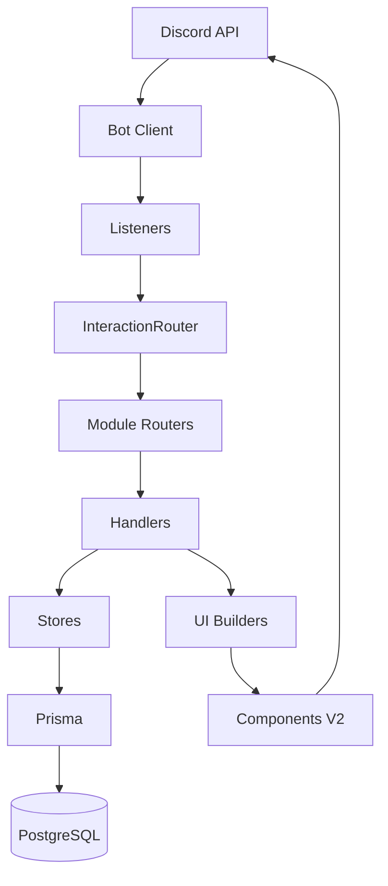
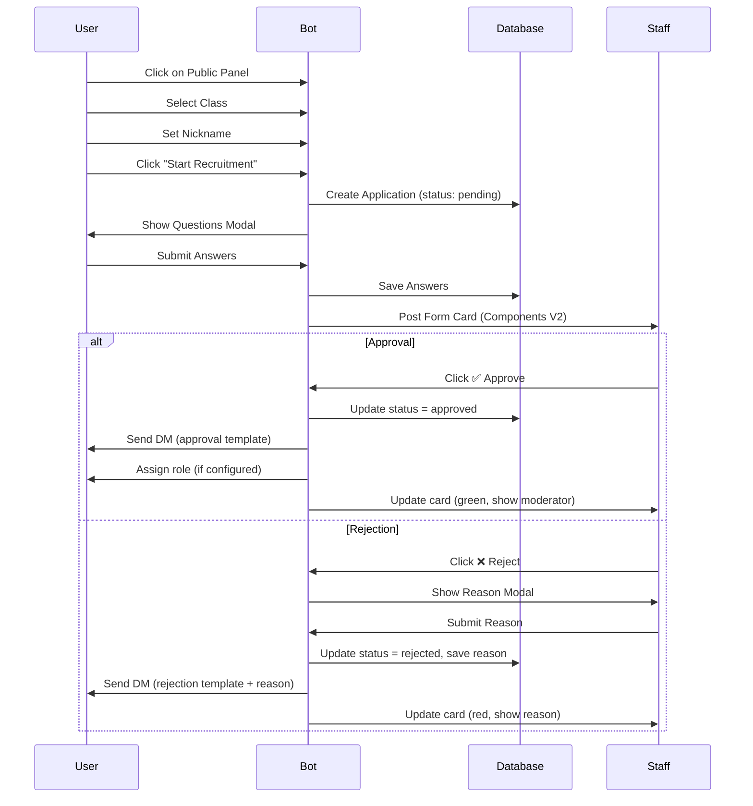
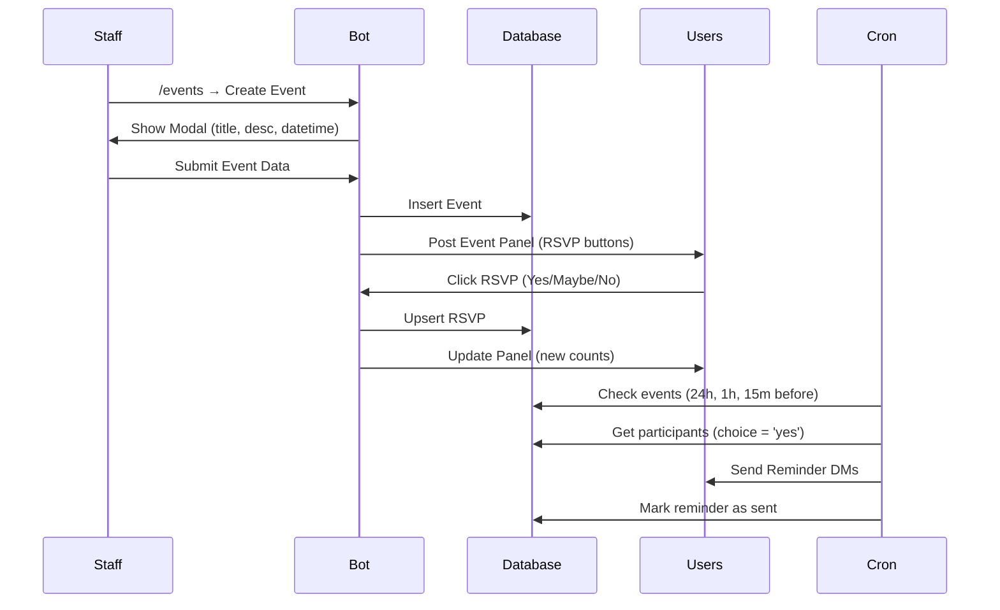

# ZenKae Bot - Documentação Técnica Completa

> **Bot Discord multifuncional** para gerenciamento de servidor, recrutamento, eventos, atividades e enquetes.

---

## 📋 Sumário

1. [Visão Geral](#visão-geral)
2. [Arquitetura](#arquitetura)
3. [Stack Tecnológico](#stack-tecnológico)
4. [Estrutura do Projeto](#estrutura-do-projeto)
5. [Funcionalidades](#funcionalidades)
6. [Banco de Dados](#banco-de-dados)
7. [Infraestrutura](#infraestrutura)
8. [Deployment](#deployment)
9. [Fluxos Completos](#fluxos-completos)
10. [Manutenção](#manutenção)

---

## 🎯 Visão Geral

**ZenKae Bot** é um bot Discord corporativo desenvolvido em TypeScript com arquitetura modular, focado em automatizar processos de gerenciamento de servidor, incluindo:

- **Sistema de Recrutamento** completo (candidaturas, aprovação/rejeição, DMs automáticas)
- **Gerenciamento de Eventos** com RSVP e lembretes
- **Sistema de Atividade** (check-in semanal, rastreamento de mensagens e voz)
- **Sistema de Enquetes** interativas
- **Dashboard administrativo** integrado
- **Components V2** do Discord para UIs modernas

**Status**: Produção ativa (Squarecloud)  
**Repositório**: `zenkaedev/Zenkae`  
**Versão**: 1.0.0

---

## 🏗️ Arquitetura

### Padrão de Design

**Arquitetura modular** baseada em:
- **MVC-like** (Modules-Views-Controllers)
- **Event-Driven** (Discord.js event system)
- **Repository Pattern** (Prisma stores)
- **Dependency Injection** (Context singleton)
- **Router Pattern** (InteractionRouter)



### Camadas da Aplicação

#### 1. **Infrastructure Layer** (`src/infra/`)
Componentes fundamentais reutilizáveis:

- **Context** ([context.ts](file:///c:/Users/mjuni/Desktop/Marcos%20Araujo/Projetos%20Pessoais/TypeScript/src/infra/context.ts))
  ```typescript
  export const Context = {
    client: Client,
    prisma: PrismaClient,
    logger: Logger,
    env: EnvVars
  };
  ```
  - Singleton de injeção de dependências
  - Acesso global aos recursos compartilhados

- **Logger** ([logger.ts](file:///c:/Users/mjuni/Desktop/Marcos%20Araujo/Projetos%20Pessoais/TypeScript/src/infra/logger.ts))
  - Pino (high-performance logging)
  - JSON em produção (pino-pretty desabilitado)
  - Contexto de interação automático

- **Router** ([router.ts](file:///c:/Users/mjuni/Desktop/Marcos%20Araujo/Projetos%20Pessoais/TypeScript/src/infra/router.ts))
  ```typescript
  class InteractionRouter {
    button(matcher, handler);
    modal(matcher, handler);
    select(matcher, handler);
    execute(interaction);
  }
  ```
  - Roteamento tipo-seguro de interações
  - Suporte a string literal e RegExp
  - Composição de routers modulares

- **Error Handler** ([errors.ts](file:///c:/Users/mjuni/Desktop/Marcos%20Araujo/Projetos%20Pessoais/TypeScript/src/infra/errors.ts))
  - `AppError` class para erros estruturados
  - `handleError()` helper com logging
  - Mensagens user-friendly automáticas

#### 2. **Module Layer** (`src/modules/`)
Lógica de negócio organizada por domínio:

- **recruit/** - Sistema de recrutamento
  - `interactions.ts` - Router de interações
  - `panel.ts` - Handlers staff
  - `card.ts` - Builder de componentes V2
  - `store.ts` - Repository pattern
  - `staff.ts` - Dashboard recruitment

- **events/** - Sistema de eventos RSVP
  - `interactions.ts` - Router de eventos
  - `staff.ts` - Dashboard events
  - `rsvp.ts` - Lógica de confirmação

- **activity/** - Rastreamento de atividade
- **poll/** - Sistema de enquetes
- **admin/** - Ferramentas administrativas

#### 3. **UI Layer** (`src/ui/`)
Builders de componentes Discord:

- **v2.ts** - Sistema unificado Components V2
  ```typescript
  buildScreen({
    banner, title, subtitle, body,
    buttons, selects, back
  })
  ```
- **recruit/** - UIs específicas de recrutamento
- **ids.ts** - IDs nomeados para interações

#### 4. **Data Layer** 
- **Prisma ORM** (`src/prisma/`)
- **Stores** (Repository pattern)
- **PostgreSQL** (Squarecloud managed)

---

## 💻 Stack Tecnológico

### Runtime & Language
- **Node.js** v25.1.0 (production) / ≥18.17 (minimum)
- **TypeScript** 5.9.2
  - ES2022 target
  - NodeNext module resolution
  - Strict mode enabled

### Core Dependencies

| Package | Versão | Uso |
|---------|--------|-----|
| `discord.js` | 14.25.1 | Discord API wrapper |
| `@prisma/client` | 5.17.0 | ORM para PostgreSQL |
| `pino` | 9.9.0 | High-performance logging |
| `zod` | 3.23.8 | Schema validation |
| `tsx` | 4.20.5 | TypeScript execution |
| `dotenv` | 16.4.5 | Environment variables |
| `@sentry/node` | 10.5.0 | Error tracking (opcional) |

### Dev Dependencies
- **ESLint** + TypeScript ESLint
- **Prettier** (code formatting)
- **Prisma CLI** (migrations)

### Database
- **PostgreSQL** (managed by Squarecloud)
  - Connection via `DATABASE_URL`
  - Direct connection via `DIRECT_URL`

---

## 📁 Estrutura do Projeto

```
TypeScript/
├── prisma/
│   ├── schema.prisma          # Database schema
│   ├── migrations/            # Migration history
│   └── seed.ts                # Database seeding
│
├── src/
│   ├── index.ts               # Entry point + bootstrap
│   ├── env.ts                 # Environment validation (Zod)
│   ├── container.ts           # Dashboard aggregator
│   │
│   ├── infra/                 # Infrastructure layer
│   │   ├── context.ts         # DI container
│   │   ├── logger.ts          # Pino logger
│   │   ├── router.ts          # Interaction router
│   │   └── errors.ts          # Error handling
│   │
│   ├── commands/              # Slash commands
│   │   ├── index.ts           # Command loader
│   │   ├── dash.ts            # /dash command
│   │   ├── recruit.ts         # /recruit command
│   │   ├── events.ts          # /events command
│   │   ├── poll.ts            # /poll command
│   │   ├── activity.ts        # /activity command
│   │   ├── rank.ts            # /rank command
│   │   └── admin.ts           # /admin command
│   │
│   ├── listeners/             # Discord event listeners
│   │   ├── interactions.ts    # Main interaction router
│   │   ├── messageCount.ts    # Message tracking
│   │   └── voiceActivity.ts   # Voice tracking
│   │
│   ├── modules/               # Business logic (by domain)
│   │   ├── recruit/
│   │   │   ├── interactions.ts
│   │   │   ├── panel.ts
│   │   │   ├── card.ts
│   │   │   ├── store.ts
│   │   │   ├── store.drafts.ts
│   │   │   ├── staff.ts
│   │   │   └── types.ts
│   │   ├── events/
│   │   ├── activity/
│   │   ├── poll/
│   │   └── admin/
│   │
│   ├── ui/                    # Component builders
│   │   ├── v2.ts              # Components V2 system
│   │   ├── ids.ts             # Interaction IDs
│   │   └── recruit/
│   │       ├── panel.public.ts
│   │       ├── settings.classe.ts
│   │       └── cards.ts
│   │
│   ├── guards/                # Permission checks
│   │   └── staff.ts           # assertStaff()
│   │
│   ├── db/                    # Database utilities
│   │   ├── prisma.ts          # Prisma client export
│   │   └── repos/             # Repositories
│   │
│   ├── services/              # External services
│   │   ├── banner.ts          # Banner fetching
│   │   └── sentry.ts          # Error tracking
│   │
│   └── scheduler/             # Cron jobs
│       └── events.ts          # Event reminders
│
├── package.json
├── tsconfig.json
├── .env                       # Environment variables
└── README.md
```

---

## ⚙️ Funcionalidades

### 1. 📋 Sistema de Recrutamento

**Objetivo**: Automatizar processo de candidaturas para servidor

#### Features:
- **Painel Público** (Components V2)
  - Select de classes customizáveis
  - Campo de nickname
  - Questionário dinâmico (até 4 perguntas)
  
- **Dashboard Staff**
  - Filtros: Todos, Pendentes, Aprovados, Recusados
  - Botão "Publicar Painel"
  - Botão "Limpar Finalizados"
  - Configurações completas

- **Configurações**
  - **Classes**: Nome, Emoji, Cor, Cargo
  - **Perguntas**: Até 4 campos customizáveis
  - **Aparência**: Título, Descrição, Imagens, Cor
  - **Templates DM**: Aprovação e Recusa (suporta `{reason}`)
  - **Canais**: Canal do Painel / Canal de Formulários

- **Formulários (Components V2)**
  - Avatar + Banner do usuário
  - Nickname, Classe, Atividade (msgs)
  - Q&A formatado
  - Botões: ✅ Aprovar / ❌ Recusar
  - Status dinâmico com cores

- **Aprovação/Rejeição**
  - DM automática ao candidato
  - Atribuição de cargo (opcional)
  - Card atualiza com status
  - Registro de moderador e timestamp

**Commands**:
- `/recruit` - Abre dashboard de recrutamento

**Interações**: 33 handlers (buttons, selects, modals)

---

### 2. 📅 Sistema de Eventos (RSVP)

**Objetivo**: Organizar eventos com confirmação de presença

#### Features:
- **Criação de Eventos**
  - Título, Descrição, Data/Hora
  - Canal de publicação automática

- **RSVP Interativo**
  - Botões: ✅ Sim / ❓ Talvez / ❌ Não
  - Contadores em tempo real
  - Registro de participantes

- **Lembretes Automáticos**
  - 24h antes
  - 1h antes
  - 15min antes
  - `Cron job` via scheduler

- **Gerenciamento**
  - Cancelar evento
  - Notificar participantes manualmente
  - Dashboard com próximos eventos

**Commands**:
- `/events` - Abre dashboard de eventos

**Interações**: 5 handlers

**Database**: 
- `Event` - Informações do evento
- `EventRsvp` - Registro de confirmações
- `EventReminder` - Controle de lembretes enviados

---

### 3. 📊 Sistema de Atividade

**Objetivo**: Rastrear e exibir atividade dos membros

#### Features:

##### **Message Tracking**
- Contador automático de mensagens por usuário
- Atualização em tempo real (listener)
- Armazenamento: `MessageCounter` table

##### **Voice Tracking**
- Rastreamento de tempo em calls
- Semanal + Total acumulado
- Armazenamento: `VoiceActivity`, `VoiceActivityWeek`

##### **Check-in Semanal**
- Painel interativo
  - Botão "Check-in"
  - Lista de membros ativos
  - Data de início da semana
- Atualização automática (lembre membros)

##### **Rank**
- `/rank` - Exibe ranking de atividade
  - Top mensagens
  - Top tempo em voz
  - Filtros por período

**Commands**:
- `/activity` - Gerenciar atividade
- `/rank` - Ver rankings

**Interações**: 2 handlers

**Database**:
- `MessageCounter` - Contador de mensagens
- `VoiceActivity` - Tempo total em voz
- `VoiceActivityWeek` - Tempo semanal em voz  
- `MemberActivity` - Check-ins
- `ActivityPanel` - Referência ao painel publicado

---

### 4. 📊 Sistema de Enquetes

**Objetivo**: Criar e gerenciar enquetes interativas

#### Features:
- **Criação via Modal**
  - Pergunta
  - Até 10 opções
  - Múltipla escolha (opcional)
  - Prazo (opcional)

- **Votação Interativa**
  - Botões dinâmicos
  - Atualização em tempo real
  - Proteção contra duplicatas

- **Resultados**
  - Contadores por opção
  - Percentuais
  - Lista de votantes (invisível ao usuário)

**Commands**:
- `/poll` - Criar enquete

**Interações**: 2 handlers

**Database**:
- `Poll` - Informações da enquete
- `PollVote` - Registros de votos

---

### 5. 🛠️ Ferramentas Administrativas

#### Features:
- **Cleanup** (`/admin cleanup`)
  - Remove mensagens antigas
  - Limpa canais específicos

- **Dashboard Centralizado** (`/dash`)
  - Abas: Home, Recrutamento, Eventos, Admin
  - Navegação fluida entre módulos
  - Banners customizados por aba

**Interações**: 2 handlers

---

## 🗄️ Banco de Dados

### Schema Overview (Prisma)

#### **Recruitment**
```prisma
model Application {
  id          String   @id @default(cuid())
  guildId     String
  userId      String
  username    String
  nick        String
  className   String
  classId     String?
  status      String   @default("pending")
  qAnswers    String   @default("[]")
  reason      String?
  messageId   String?
  channelId   String?
  
  moderatedById      String?
  moderatedByDisplay String?
  moderatedAt        DateTime?
  
  createdAt   DateTime @default(now())
  updatedAt   DateTime @updatedAt
  
  @@index([guildId, userId])
  @@index([guildId, status, createdAt])
}

model RecruitSettings {
  guildId               String  @id
  panelChannelId        String?
  formsChannelId        String?
  
  appearanceTitle       String?
  appearanceDescription String?
  appearanceImageUrl    String?
  appearanceThumbUrl    String?
  appearanceAccent      Int?
  
  questions             String   @default("[]")
  classes               String   @default("[]")
  defaultApprovedRoleId String?
  
  dmAcceptedTemplate String   @default("...")
  dmRejectedTemplate String   @default("...")
  
  createdAt          DateTime @default(now())
  updatedAt          DateTime @updatedAt
}

model RecruitPanel {
  guildId   String   @id
  channelId String
  messageId String
  updatedAt DateTime @updatedAt
}
```

#### **Events**
```prisma
model Event {
  id          String   @id @default(cuid())
  guildId     String
  title       String
  description String?
  startsAt    DateTime
  status      String   @default("scheduled")
  channelId   String
  messageId   String
  createdAt   DateTime @default(now())
  
  rsvps     EventRsvp[]
  reminders EventReminder[]
}

model EventRsvp {
  id        String   @id
  eventId   String
  userId    String
  choice    String   // 'yes' | 'maybe' | 'no'
  
  @@unique([eventId, userId])
}

model EventReminder {
  id      String   @id
  eventId String
  kind    String   // '24h' | '1h' | '15m'
  sentAt  DateTime @default(now())
  
  @@unique([eventId, kind])
}
```

#### **Activity**
```prisma
model MessageCounter {
  guildId   String
  userId    String
  count     Int      @default(0)
  
  @@unique([guildId, userId])
}

model VoiceActivity {
  guildId      String
  userId       String
  totalSeconds Int      @default(0)
  
  @@id([guildId, userId])
}

model VoiceActivityWeek {
  guildId      String
  userId       String
  weekStart    DateTime
  totalSeconds Int      @default(0)
  
  @@id([guildId, userId, weekStart])
}

model MemberActivity {
  guildId     String
  userId      String
  lastCheckAt DateTime @default(now())
  
  @@unique([guildId, userId])
}

model ActivityPanel {
  guildId   String   @id
  channelId String
  messageId String
  weekStart DateTime
}
```

#### **Polls**
```prisma
model Poll {
  id          String   @id @default(cuid())
  guildId     String
  question    String
  optionsJson String   // JSON array
  multi       Boolean  @default(false)
  endsAt      DateTime?
  createdById String
  
  votes PollVote[]
}

model PollVote {
  pollId    String
  userId    String
  optionIdx Int
  
  @@unique([pollId, userId, optionIdx])
}
```

### Migrations
```bash
# Gerar migration
npm run prisma:migrate

# Deploy production
npm run migrate:deploy

# View data
npm run db:studio
```

---

## 🏗️ Infraestrutura

### Environment Variables

```env
# Required
DISCORD_TOKEN=              # Bot token
DISCORD_GUILD_ID=           # Main guild ID
DATABASE_URL=               # PostgreSQL connection
DIRECT_URL=                 # Direct connection (bypasses pooling)

# Optional
STAFF_ROLE_ID=              # Role ID for staff permissions
DEBUG=                      # Enable debug mode
SENTRY_DSN=                 # Error tracking
NODE_ENV=production         # Environment mode
```

**Validation**: Zod schema em `src/env.ts`

### Logging System

**Pino Configuration**:
```typescript
// Development
- pino-pretty enabled (colorful, human-readable)

// Production  
- JSON output (fast, structured)
- pino-pretty DISABLED (performance)
```

**Log Levels**:
- `trace` - Debugging detalhado
- `debug` - Informações de debug
- `info` - Operações normais ✅
- `warn` - Avisos
- `error` - Erros ❌
- `fatal` - Erros críticos

**Context Injection**:
```typescript
logger.info({ 
  type: 'interaction',
  id: customId,
  user: username,
  guildId 
}, 'Interaction Received');
```

### Error Handling

**AppError Class**:
```typescript
class AppError extends Error {
  constructor(
    message: string,        // User-facing
    internalMessage?: string, // For logs
    code?: string
  )
}
```

**Usage**:
```typescript
try {
  // operation
} catch (err) {
  handleError(interaction, err, 'Operation failed');
}
```

**User Feedback**: Mensagens ephemeral automáticas

---

## 🚀 Deployment

### Platform: Squarecloud

**Características**:
- Managed Node.js hosting
- Integrated PostgreSQL
- Auto-restart on crashes
- Environment variables management

### Deploy Steps

1. **Build**
```bash
npm run build
```

2. **Push to GitHub**
```bash
git add .
git commit -m "feat: new feature"
git push
```

3. **Squarecloud Auto-Deploy**
- Monitora branch `main`
- Pull automático
- Rebuild
- Restart

### Production Checklist
- [ ] `NODE_ENV=production` set
- [ ] `DATABASE_URL` configured
- [ ] All migrations deployed
- [ ] Sentry DSN configured (optional)
- [ ] Discord token updated
- [ ] Guild ID correct

### Monitoring

**Logs**: Squarecloud dashboard ou API
```bash
# View production logs
squarectl logs <app-id>
```

**Metrics**:
- Uptime
- Memory usage
- Database connections
- Error rate (Sentry)

---

## 🔄 Fluxos Completos

### 1. Recruitment Flow



### 2. Event Flow



### 3. Dashboard Navigation

```mermaid
graph LR
    A[/dash] --> B{Select Tab}
    B -->|recruit| C[Recruit Dashboard]
    B -->|events| D[Events Dashboard]
    B -->|admin| E[Admin Dashboard]
    B -->|home| F[Home]
    
    C --> G[Filter Select]
    C --> H[Publish Panel]
    C --> I[Settings]
    C --> J[Clear Completed]
    
    I --> K[Classes]
    I --> L[Questions]
    I --> M[Appearance]
    I --> N[DM Templates]
    I --> O[Channels]
```

---

## 🛠️ Manutenção

### Common Tasks

#### Add New Command
1. Create `src/commands/mycommand.ts`
```typescript
import { SlashCommandBuilder } from 'discord.js';

export const data = new SlashCommandBuilder()
  .setName('mycommand')
  .setDescription('My command');

export async function execute(interaction) {
  // handler
}
```

2. Auto-loaded by `src/commands/index.ts`

3. Deploy
```bash
npm run deploy:global
```

#### Add New Module
1. Create `src/modules/mymodule/`
2. Add `interactions.ts` with router
3. Register in `src/listeners/interactions.ts`
```typescript
import { myModuleRouter } from '../modules/mymodule/interactions.js';
mainRouter.use(myModuleRouter);
```

#### Database Changes
1. Edit `prisma/schema.prisma`
2. Create migration
```bash
npm run prisma:migrate
```
3. Deploy to production
```bash
npm run migrate:deploy
```

### Code Quality

**Linting**:
```bash
npm run lint        # Check
npm run lint:fix    # Auto-fix
```

**Formatting**:
```bash
npm run format
```

**Type Checking**:
```bash
npm run build
```

### Troubleshooting

#### Bot not responding
1. Check logs: `logger.error` entries
2. Verify Discord token
3. Check perms: `GUILDS`, `GUILD_MESSAGES`, `MANAGE_ROLES`

#### Database connection failed
1. Check `DATABASE_URL` format
2. Verify Squarecloud DB status
3. Check connection pool limits

#### Interactions timing out
1. Check if handler defers within 3s
2. Verify no blocking operations
3. Check Squarecloud performance

#### Panel not Publishing
✅ **FIXED**: Automatic stale data recovery implemented

---

## 📚 Resources

### Documentation Links
- [Discord.js Guide](https://discordjs.guide)
- [Prisma Docs](https://www.prisma.io/docs)
- [Discord Components V2](https://discord.com/developers/docs/interactions/message-components)
- [Pino Logger](https://getpino.io)

### Internal Docs
- [Recruitment Flow](./recruitment_flow.md)
- [Implementation Plan](./implementation_plan.md)
- [Walkthrough](./walkthrough.md)
- [Task List](./task.md)

### Contact
- **Developer**: Marcos (hijunin)
- **Organization**: ZenKae Dev
- **Repository**: github.com/zenkaedev/Zenkae

---

## 📊 Statistics

- **Total Lines**: ~15,000
- **Modules**: 5 (Recruit, Events, Activity, Poll, Admin)
- **Commands**: 7 slash commands
- **Interactions**: 45 handlers (27 buttons, 5 selects, 12 modals, 1 command routing)
- **Database Tables**: 13
- **Dependencies**: 8 production + 11 dev

---

**Last Updated**: 2026-01-06  
**Bot Version**: 1.0.0  
**Documentation Version**: 1.0
