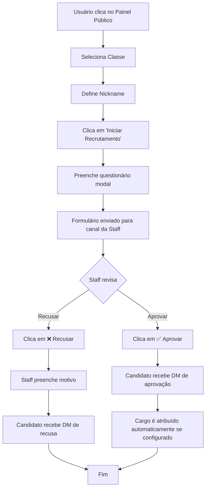

# Processo Completo de Aprovação de Candidaturas

## 📊 Fluxo Geral



---

## 🎯 Etapa 1: Candidatura do Usuário

### 1.1 Painel Público
**Localização**: Canal configurado em "Canal Painel"

**Componentes**:
- Select de Classes
- Botão "Definir Nick"
- Botão "Iniciar Recrutamento"

### 1.2 Fluxo de Preenchimento

1. **Selecionar Classe**
   - Usuário escolhe no select menu
   - Draft salvo: `recruitDrafts.setUserDraft(guildId, userId, { classId })`
   - Feedback: "✅ Classe salva..."

2. **Definir Nickname**
   - Modal com campo de texto (max 32 chars)
   - Draft salvo: `recruitDrafts.setUserDraft(guildId, userId, { nick })`
   - Feedback: "✅ Nick salvo..."

3. **Iniciar Recrutamento**
   ```typescript
   // Validações
   if (!draft.nick) → abre modal de nick automaticamente
   if (!draft.classId) → "⚠️ Selecione sua classe antes de iniciar"
   
   // Criação da Application no banco
   const app = await recruitStore.create({
     guildId,
     userId,
     username: inter.user.username,
     nick: draft.nick,
     className: cls?.name,
     classId: draft.classId,
   });
   
   // Busca contagem de mensagens do usuário
   activityCount = await recruitStore.getMessageCount(guildId, userId);
   
   // Limpa draft
   await recruitDrafts.clearUserDraft(guildId, userId);
   ```

4. **Modal de Perguntas**
   - Até 4 perguntas configuradas pela staff
   - ID do modal: `recruit:pub:apply:q:modal:{appId}:{total}`
   - Respostas salvas: `recruitStore.setAnswers(appId, answers)`

---

## 📝 Etapa 2: Publicação do Formulário

### 2.1 Card de Candidatura

**Enviado para**: Canal configurado em "Canal Forms"

**Estrutura do Card** ([card.ts](file:///c:/Users/mjuni/Desktop/Marcos%20Araujo/Projetos%20Pessoais/TypeScript/src/modules/recruit/card.ts)):
```
┌─────────────────────────────────┐
│ 📋 Nova Candidatura             │
├─────────────────────────────────┤
│ 👤 Nick: {nick}                 │
│ 🛡️ Classe: {className}          │
│ 📊 Atividade: {activityCount}   │
│ 🆔 Discord: @{username}         │
│                                 │
│ Perguntas & Respostas:          │
│ 1. {question} → {answer}        │
│ ...                             │
├─────────────────────────────────┤
│ [✅ Aprovar] [❌ Recusar]       │
└─────────────────────────────────┘
```

**Dados armazenados**:
- `channelId` e `messageId` do card para futuras atualizações
- Status inicial: `'pending'`

---

## ✅ Etapa 3: Aprovação

### 3.1 Fluxo de Aprovação

**Handler**: [`handleDecisionApprove`](file:///c:/Users/mjuni/Desktop/Marcos%20Araujo/Projetos%20Pessoais/TypeScript/src/modules/recruit/panel.ts#L372) (panel.ts)

**Processo**:
```typescript
1. Busca aplicação: await recruitStore.getById(appId)
2. Valida se existe e status é 'pending'
3. Atualiza status no banco:
   await recruitStore.moderate(appId, {
     status: 'approved',
     moderatedById: inter.user.id,
     moderatedByDisplay: inter.user.tag
   })

4. Envia DM ao candidato:
   const dmText = settings.dmAcceptedTemplate || "Parabéns! Você foi aprovado 🎉"
   await user.send(dmText)

5. Atribui cargo (se configurado):
   if (settings.defaultApprovedRoleId) {
     const role = await guild.roles.fetch(settings.defaultApprovedRoleId)
     await member.roles.add(role)
   }

6. Atualiza card do formulário:
   - Adiciona embed verde "✅ Aprovado por {moderador}"
   - Remove botões de A

ção/Rejeição
   await message.edit({ embeds: [...embeds, approvedEmbed], components: [] })

7. Feedback para staff:
   "✅ Candidatura aprovada com sucesso."
```

### 3.2 Template de DM de Aprovação

**Padrão**: `"Parabéns! Você foi aprovado 🎉"`

**Editável em**: Settings → Templates DM → Campo "Mensagem de Aprovação"

---

## ❌ Etapa 4: Recusa

### 4.1 Fluxo de Recusa

**Handler**: [`handleDecisionRejectOpen`](file:///c:/Users/mjuni/Desktop/Marcos%20Araujo/Projetos%20Pessoais/TypeScript/src/modules/recruit/panel.ts#L394) → [`handleDecisionRejectSubmit`](file:///c:/Users/mjuni/Desktop/Marcos%20Araujo/Projetos%20Pessoais/TypeScript/src/modules/recruit/panel.ts#L402)

**Processo**:
```typescript
1. Clique em "❌ Recusar" abre modal
   Modal ID: recruit:decision:reject:modal:{appId}
   Campo: "Motivo da recusa" (obrigatório, max 300 chars)

2. Submissão do modal:
   const reason = inter.fields.getTextInputValue('reason')

3. Atualiza status no banco:
   await recruitStore.moderate(appId, {
     status: 'rejected',
     reason: reason,
     moderatedById: inter.user.id,
     moderatedByDisplay: inter.user.tag
   })

4. Envia DM ao candidato:
   const template = settings.dmRejectedTemplate
   const dmText = template.replace('{reason}', reason)
   // Padrão: "Obrigado por se inscrever. Infelizmente sua candidatura foi recusada. Motivo: {reason}"
   await user.send(dmText)

5. Atualiza card do formulário:
   - Adiciona embed vermelho "❌ Recusado por {moderador}"
   - Mostra motivo da recusa
   - Remove botões
   await message.edit({ embeds: [...embeds, rejectedEmbed], components: [] })

6. Feedback para staff:
   "❌ Candidatura recusada."
```

### 4.2 Template de DM de Recusa

**Padrão**: `"Obrigado por se inscrever. Infelizmente sua candidatura foi recusada. Motivo: {reason}"`

**Variáveis disponíveis**: `{reason}` = motivo informado pela staff

**Editável em**: Settings → Templates DM → Campo "Mensagem de Recusa"

---

## 🗄️ Banco de Dados

### Tabela: `Application`

```prisma
model Application {
  id        String   @id
  guildId   String
  userId    String
  username  String
  nick      String
  className String
  classId   String?
  status    String   @default("pending") // 'pending' | 'approved' | 'rejected'
  qAnswers  String   @default("[]")
  reason    String?  // Apenas para rejected
  messageId String?
  channelId String?
  
  // Moderação
  moderatedById      String?
  moderatedByDisplay String?
  moderatedAt        DateTime?
  
  createdAt DateTime @default(now())
  updatedAt DateTime @updatedAt
}
```

---

## 🔧 Configurações Necessárias

### Pré-requisitos para sistema funcionar:

1. **Canal Painel** (público)
   - Onde usuários iniciam candidatura
   - Configurado em: Settings → Canal Painel

2. **Canal Forms** (staff only)
   - Onde aparecem os formulários
   - Configurado em: Settings → Canal Forms

3. **Classes** (mínimo 1)
   - Criadas em: Settings → Classes

4. **Perguntas** (opcional, até 4)
   - Configuradas em: Settings → Perguntas

5. **Templates DM** (opcional)
   - Mensagem de aprovação
   - Mensagem de recusa (suporta `{reason}`)

6. **Cargo de Aprovação** (opcional)
   - Atribuído automaticamente ao aprovar
   - Configurado em: Settings → (não vejo opção na UI atual, pode estar faltando)

---

## 🧹 Limpeza de Candidaturas

**Botão**: "🗑️ Limpar Finalizados" (dashboard de recrutamento)

**Função**: Remove TODAS as candidaturas com status `'approved'` ou `'rejected'`

**Aviso**: Ação irreversível! Mantém apenas `'pending'`

---

## 📊 Resumo das Permissões

| Ação | Permissão Necessária |
|------|---------------------|
| Candidatar-se | Qualquer usuário |
| Ver formulários | Canal Forms configurado |
| Aprovar/Recusar | Staff (ManageGuild ou ManageRoles ou STAFF_ROLE_ID) |
| Configurar sistema | Staff |
| Limpar finalizados | Staff |

---

## 🐛 Troubleshooting

**Problema**: "Painel não aparece ao publicar"
- ✅ **RESOLVIDO**: Sistema agora detecta e limpa dados obsoletos automaticamente

**Problema**: "Usuário não recebe DM"
- Verificar se DMs estão abertas
- Verificar se bot tem permissão de enviar DM

**Problema**: "Cargo não é atribuído"
- Verificar se `defaultApprovedRoleId` está configurado
- Verificar se bot tem permissão de gerenciar cargos
- Verificar se cargo do bot está acima do cargo a ser atribuído

**Problema**: "Card não atualiza após decisão"
- Verificar se bot tem permissão de editar mensagens no canal Forms
- Verificar se mensagem ainda existe (não foi deletada)
